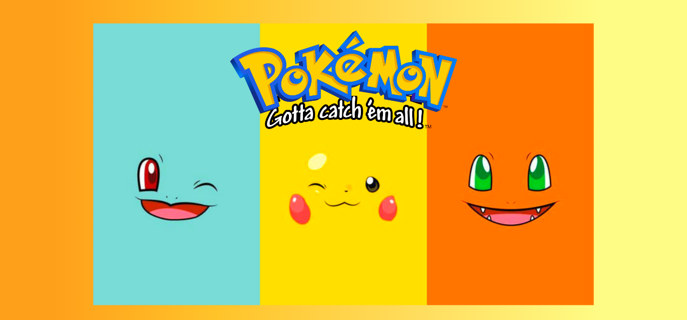
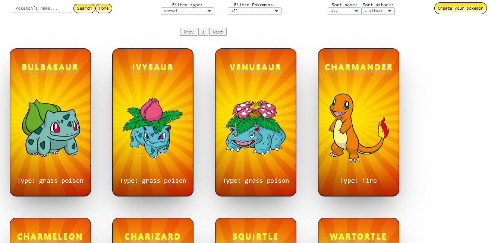
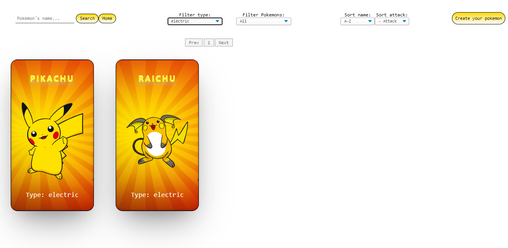
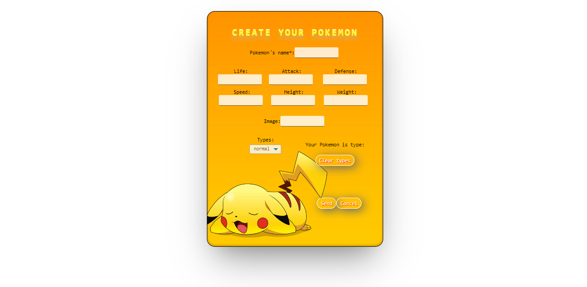
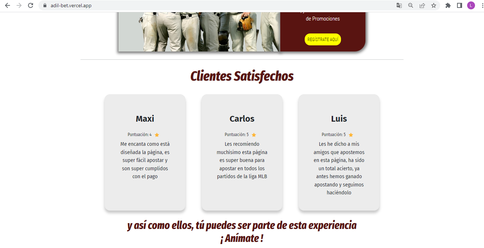
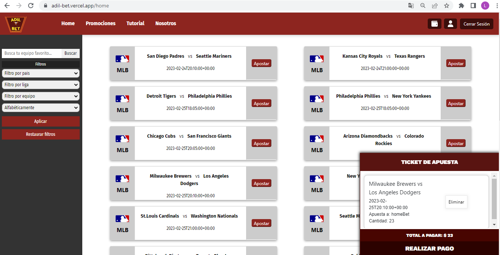
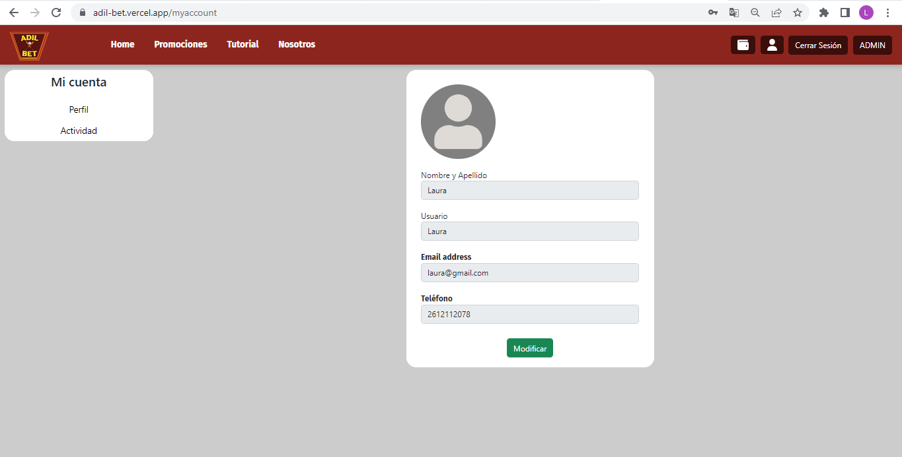
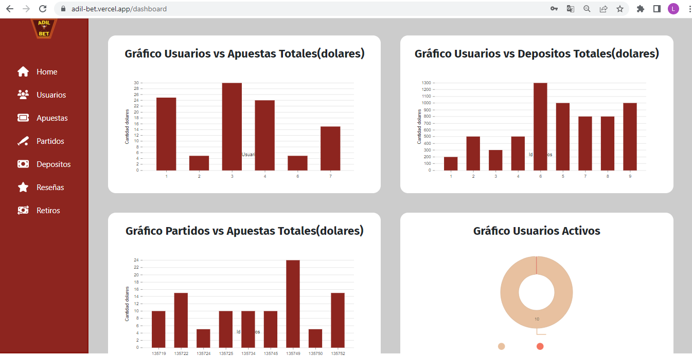

<h1 align="center">Hi 👋, I'm Laura Valencia </h1>
<h3 align="center">Full Stack Web Developer from Colombia</h3>

Ease to learn new things, being very self-taught and creative at proposing solutions. 
Empowered in the topics that I am passionate about.

<h4 align="left">Connect with me:</h4>

<h3 align="left">Languages and Tools:</h3>

 
 
 
 

<!--   -->
 
 
 
<!--   -->

&nbsp;
 

## Checkout my work
👇
👇
👇   
____________________
## Pokemons SPA

~~~
📌 Henry Bootcamp Individual Project 
I worked as a Full Stack Web Developer
**Pokemon** | [Source Code](https://github.com/lauravalenciapolo/Proyecto-Individual) 

Design and develop a web page about videogames including:
◉ Search by name
◉ Filtering, Sorting and Pagination
◉ Option to create a videogame

Tech Utils: 
◉ Javascript
◉ ReactJS
◉ Redux
◉ CSS 
◉ NodeJS
◉ Express
◉ PostgreSQL
◉ Sequelize
~~~

____________________
## AdilBet  

~~~
📌 A mobile game developed to make geography more fun

Final group project of Bootcamp Henry. 
I worked as a Full Stack Web Developer. 
**AdilBet** | [Live Site](https://adil-bet.vercel.app/) | [Source Code](https://github.com/LuisRodriguzz/PF-AdilBet) 

The project has a web version and an administrator panel.

Tech Utils:
🎮 Database: PostgreSQL
🎮 Back-End: NodeJs, Express, Sequelize
🎮 Front-End: React JS, Redux, CSS, Material-UI, HTML
🎮 Additional Libraries: 
✔ Nivo (graphs)
✔ Stripe (Payment gateway)
✔ Nodemailer (Sending of mails)
✔ Auth0 (Authentication)
~~~
<h2>
Adilbet
</h2>

  

<h2>
Administrator Panel
</h2>

___________________________________________

## 📫 CONTACT ME

Do you want to work together?

**Email:** lauravalenciapolo@gmail.com

